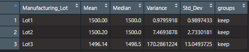
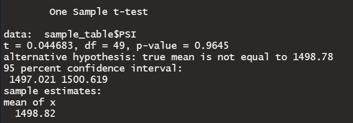
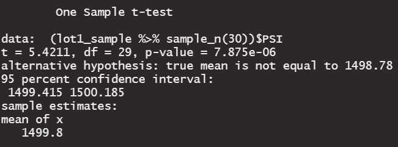
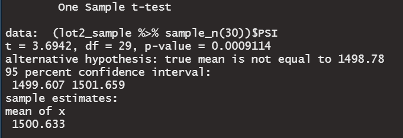
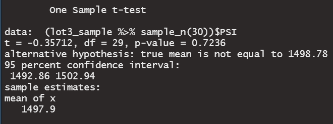

# MechaCar_Statistical_Analysis

## Purpose
Several projects to help Jeremy and analytics team using RStudio:
1. Perform linear regression analysis to predict the mpg of MechaCar prototypes and it's determing variables in our data.
2. Show summary statistics of the suspension coils overall and their respective Manufactoring Lot #.
3. Perform t-tests for all lots and individual lots and how they are statistically differenr from the mean population

## Linear Regression to Predict MPG

- Judging from the p values that are much lower than the significance level of 0.05, we can safely say that the (Intercept), vehicle length, and ground clearance provide a non-random amount of variance to the mpg values in the dataset.
- The slope of the linear model connot be considered to be zero. Our formula for predicting mpg according to the summary output is:
	**mpg = -104 + 6.267*vehicle_length + 1.245e-03*vehicle_weight + 6.877e-02*spoiler_angle + 3.546*ground_clearance -3.411*AWD**

- Using the statiscal measure R squared value of 0.71, we can say that 71% of the variations can be explained by our linear model. Meaning 71% of the future data points will fit in the above linear model. 

## Summary Statistics on Suspension Coils
### All Lots Statistics

### Individual Lot Statistics

The design sepcifications state that the variance of the suspension coils must not exceed 100 pounds per square inch.
- The overall lots specification falls into the design specification with an overall variance of 62.3 pounds per square inch.
- Our individual lot summary shows that Lot 1 and Lot 2 are within the design specifcation with variances of 0.98 and 7.47 pounds per square inch respectively.
- Lot 3 however, is not within the design specification with a variance of 170.29 pounds per square inch.

## T-Tests on Suspension Coils
### T-Test for all Lots

Testing the sample size of 50 across all the lots to the population of 150, we found a p-value of 0.9645. Comparing to the significance level of 0.05, it is safe to say the PSI across all lots are statiscally similar to the population mean.

### T-Test Lot 1

Testing the sample size of 30 within Lot 1, we found a p-value of 7.875e-06. Comparing to the significance level of 0.05, it is safe to say the PSI for Lot 1 are statiscally different to the population mean.

### T-Test Lot 2

Testing the sample size of 30 within Lot 2, we found a p-value of 0.0009114. Comparing to the significance level of 0.05, it is safe to say the PSI for Lot 2 are statiscally different to the population mean.

### T-Test Lot 3

Testing the sample size of 30 within Lot 3, we found a p-value of 0.7236. Comparing to the significance level of 0.05, it is safe to say the PSI for Lot 3 are statiscally similar to the population mean.

## Study Design: MechaCar vs Competition
Several statistical study to compare against competitions:
- price to similiar vehicle models
- safety performace
- CO2-e emmissions per mile (how environmental friendly)
- car's life expectancy (how often people retired their vehicle after purchase)
- noise pollution (decibels)

Our null hypothesis is to find if each metric above is statistically similar to vehicles of similar type to AutosRU's prototype, MechaCar, from the competitors. We will perform the analysis of variance (ANOVA) test since we're dealing with large real-worl numerical data. ANOVA tests are used to compare the means of continuous numerical variable across a number of groups, and in this case which is our competitors' vehicle data. As for what data is needed to run our tests, basically as many data from the metrics listed above, just have to make sure the data gathered is numerical.